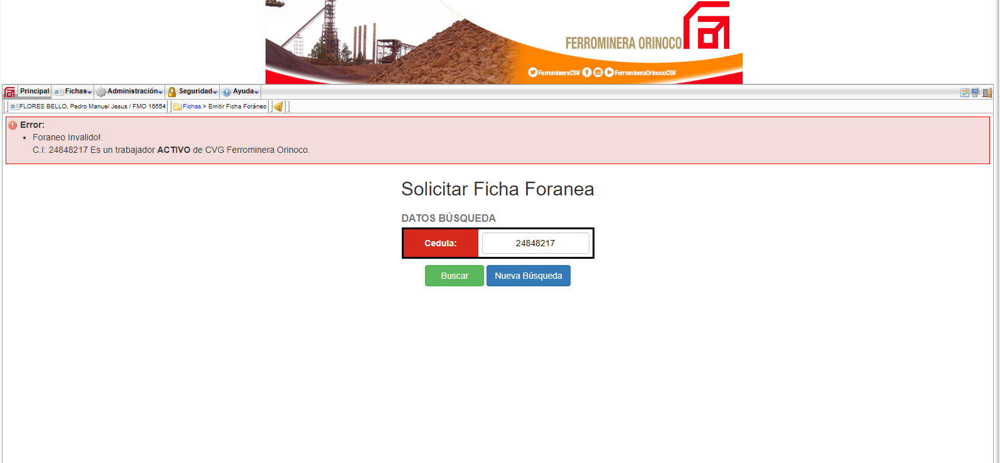

# Project Name

SCEF (Sistema de Control de Emisión de Fichas) / (Card Issuance Control System)

## Project Description

System for controlling the card issuance to the workers of the company

## Technologies

- Zend Framework 1.12
- PHP
- HTML
- CSS
- PostgreSQL

## Screenshots

Here are some screenshots of the project:

You can find more screenshots in the "screenshots" folder of this repository.